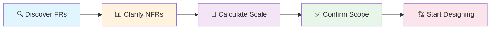
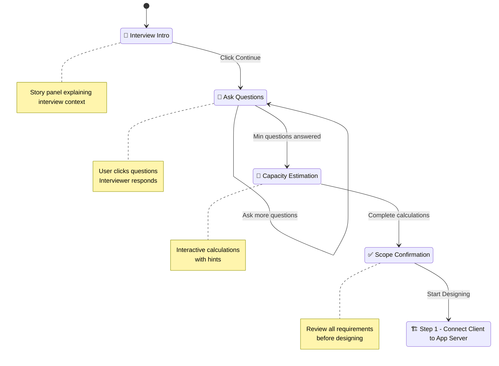

# Requirements Gathering Phase - Design Specification

## Executive Summary

This document outlines the pedagogical approach and UI/UX design for adding a **"Step 0: Requirements Gathering"** phase to the guided system design tutorial. This phase teaches candidates the critical interview skill of asking clarifying questions before designing solutions.

---

## 1. The Problem

### Current Flow (Flawed)
```
Step 1: "Welcome! Connect Client to App Server" → Immediately start building
```

### Real Interview Flow
```
Interviewer: "Design a URL shortener"
Candidate: "Before I start, can I ask some clarifying questions?"
→ 5-10 minutes of requirements gathering
→ Then start designing
```

### Why This Matters

In actual system design interviews:
- **Jumping straight to solutions is a red flag** 🚩
- Candidates are expected to **ask clarifying questions**
- Requirements gathering shows **senior engineer thinking**
- It prevents building the wrong thing

---

## 2. Pedagogical Approach

### Learning Objectives

By completing Step 0, users will learn to:

1. **Identify what's unclear** in a problem statement
2. **Categorize questions** into FRs vs NFRs
3. **Prioritize** which requirements matter most
4. **Do back-of-envelope math** to size the system
5. **Negotiate scope** with the interviewer

### Teaching Philosophy

```
DON'T: Give users a checklist of questions to ask
DO:    Teach users WHY certain questions matter and WHEN to ask them
```

We use the **"Discover → Confirm → Calculate"** framework:



---

## 3. UI/UX Design

### 3.1 Phase Structure

Step 0 will have **4 sub-phases**:

```
Step 0: Requirements Gathering
├── Phase A: Interview Intro (Story)
├── Phase B: Ask Questions (Interactive Q&A)
├── Phase C: Calculate Scale (Back-of-envelope)
└── Phase D: Confirm Scope (Summary)
```

### 3.2 Phase A: Interview Intro (Story Panel)

Uses the existing [`StoryPanel.tsx`](../src/apps/system-design/builder/ui/components/guided/StoryPanel.tsx) with new content:

```typescript
const step0Story: StoryContent = {
  emoji: '🎤',
  scenario: "You're in a system design interview. The interviewer says: 'Design TinyURL.'",
  hook: "But wait! You shouldn't start drawing boxes yet. Good engineers ask questions first.",
  challenge: "Your mission: Gather requirements like a senior engineer. Ask the right questions to understand what you're building.",
  illustration: 'interview-room',
};
```

**Wireframe:**
```
┌────────────────────────────────────────────────────────────┐
│                    Step 0 of 10                             │
│                                                             │
│                       🎤                                    │
│                                                             │
│     "You're in a system design interview.                  │
│      The interviewer says: 'Design TinyURL.'"              │
│                                                             │
│     But wait! You shouldn't start drawing boxes yet.       │
│     Good engineers ask questions first.                    │
│                                                             │
│     ┌──────────────────────────────────────────────┐       │
│     │  YOUR MISSION                                 │       │
│     │  Gather requirements like a senior engineer.  │       │
│     │  Ask the right questions to understand what   │       │
│     │  you're building.                             │       │
│     └──────────────────────────────────────────────┘       │
│                                                             │
│              [ Let's Ask Questions ]                        │
│                                                             │
│           Press Enter or click to continue                  │
└────────────────────────────────────────────────────────────┘
```

### 3.3 Phase B: Interactive Q&A (NEW Component)

This is the **core innovation** - an interactive conversation with a simulated interviewer.

#### UI Layout

```
┌───────────────────────────────────────────────────────────────────────────────┐
│ Step 0 of 10 │ Requirements Gathering                         [Learn] [Practice] │
├───────────────────────────────────────────────────────────────────────────────┤
│                                                                                │
│  ┌─────────────────────────────────────────────────────────────────────────┐  │
│  │ 👤 INTERVIEWER                                              ┌─────────┐ │  │
│  │ ─────────────────────────────────────────────────────────  │  😊    │ │  │
│  │ "Design a URL shortener like bit.ly"                       │  Sarah  │ │  │
│  │                                                             │ Eng Mgr │ │  │
│  │ What questions do you have?                                └─────────┘ │  │
│  └─────────────────────────────────────────────────────────────────────────┘  │
│                                                                                │
│  ┌─────────────────────────────────────────────────────────────────────────┐  │
│  │ 🎯 YOUR QUESTIONS                                                        │  │
│  │ ──────────────────                                                       │  │
│  │ Click to ask a question. Gather all the requirements you need.          │  │
│  │                                                                          │  │
│  │ ┌──────────────────────────┐ ┌──────────────────────────┐               │  │
│  │ │ 📋 Functional            │ │ ⚡ Scale & Traffic        │               │  │
│  │ │                          │ │                           │               │  │
│  │ │ ○ What are the core      │ │ ○ How many URLs per day?  │               │  │
│  │ │   features?              │ │ ○ What read/write ratio?  │               │  │
│  │ │ ○ Do URLs expire?        │ │ ○ Expected traffic RPS?   │               │  │
│  │ │ ○ Custom short codes?    │ │ ○ Peak vs normal load?    │               │  │
│  │ │ ● Analytics needed? ✓    │ │                           │               │  │
│  │ └──────────────────────────┘ └──────────────────────────┘               │  │
│  │                                                                          │  │
│  │ ┌──────────────────────────┐ ┌──────────────────────────┐               │  │
│  │ │ ⏱️ Latency & SLA         │ │ 💰 Constraints            │               │  │
│  │ │                          │ │                           │               │  │
│  │ │ ○ Redirect latency SLA?  │ │ ○ Budget constraints?     │               │  │
│  │ │ ○ Availability target?   │ │ ○ Team size/expertise?    │               │  │
│  │ │ ○ Consistency needs?     │ │ ○ Existing infra?         │               │  │
│  │ └──────────────────────────┘ └──────────────────────────┘               │  │
│  └─────────────────────────────────────────────────────────────────────────┘  │
│                                                                                │
│  ┌─────────────────────────────────────────────────────────────────────────┐  │
│  │ 📝 ANSWERS COLLECTED: 3/8 minimum                                        │  │
│  │ ───────────────────────────────────────────────────────────────────────  │  │
│  │ ✓ Core features: Shorten URLs, Redirect to original                     │  │
│  │ ✓ Analytics: Not needed for MVP                                          │  │
│  │ ✓ URL expiration: URLs don't expire                                      │  │
│  └─────────────────────────────────────────────────────────────────────────┘  │
│                                                                                │
│  ┌─────────────────────────────────────────────────────────────────────────┐  │
│  │         [ I have enough information - Continue to Calculations ]         │  │
│  └─────────────────────────────────────────────────────────────────────────┘  │
│                                                                                │
└───────────────────────────────────────────────────────────────────────────────┘
```

#### Interaction Flow

1. **User clicks a question** → Question highlights
2. **Interviewer "answers"** → Response appears with animation
3. **Answer is added to collected answers** → Progress bar updates
4. **Once minimum questions asked** → Continue button enables

#### Visual States for Questions

```
┌─────────────────────────┐    ┌─────────────────────────┐    ┌─────────────────────────┐
│ ○ Do URLs expire?       │    │ ● Do URLs expire?       │    │ ✓ Do URLs expire?       │
│   (Available)           │    │   (Asking...)           │    │   "No, they're permanent"│
└─────────────────────────┘    └─────────────────────────┘    └─────────────────────────┘
      Unasked                       Asking                         Answered
      Gray outline                  Blue glow                      Green check
```

#### Interviewer Response Animation

When user clicks a question:

```typescript
// Typing animation for interviewer response
1. Question card glows blue (0.2s)
2. Interviewer avatar shows "thinking" animation (0.5s)
3. Speech bubble appears with typing indicator (0.3s)
4. Response text types out (1-2s, ~50ms per character)
5. Question card marks as answered (0.2s)
6. Answer is added to "Answers Collected" section (slide in)
```

### 3.4 Phase C: Back-of-Envelope Calculations (NEW Component)

After gathering requirements, users do quick math to size the system.

**Wireframe:**

```
┌───────────────────────────────────────────────────────────────────────────────┐
│ Step 0 of 10 │ Capacity Estimation                                            │
├───────────────────────────────────────────────────────────────────────────────┤
│                                                                                │
│  🧮 BACK-OF-ENVELOPE CALCULATIONS                                             │
│  ────────────────────────────────────                                          │
│  Now let's size your system based on the requirements.                        │
│                                                                                │
│  ┌─────────────────────────────────────────────────────────────────────────┐  │
│  │ Traffic Estimates                                                        │  │
│  │ ─────────────────                                                        │  │
│  │                                                                          │  │
│  │ Given: 100M URLs/month created                                           │  │
│  │                                                                          │  │
│  │ ┌──────────────────┐  ┌──────────────────┐  ┌──────────────────┐        │  │
│  │ │ Writes/sec       │  │ Read:Write Ratio │  │ Reads/sec        │        │  │
│  │ │                  │  │                  │  │                  │        │  │
│  │ │ 100M / 30 / 24   │  │       10:1       │  │   40 × 10 =      │        │  │
│  │ │ / 3600 =         │  │  (given by       │  │                  │        │  │
│  │ │                  │  │   interviewer)   │  │                  │        │  │
│  │ │ [  ~40 wps  ] ✓  │  │                  │  │ [  ~400 rps  ] ✓ │        │  │
│  │ └──────────────────┘  └──────────────────┘  └──────────────────┘        │  │
│  └─────────────────────────────────────────────────────────────────────────┘  │
│                                                                                │
│  ┌─────────────────────────────────────────────────────────────────────────┐  │
│  │ Storage Estimates                                                        │  │
│  │ ─────────────────                                                        │  │
│  │                                                                          │  │
│  │ Per URL entry: short_code (7B) + long_url (200B) + metadata (50B)       │  │
│  │              = ~250 bytes/URL                                            │  │
│  │                                                                          │  │
│  │ For 5 years: 100M × 12 × 5 = 6B URLs                                     │  │
│  │ Storage: 6B × 250B = [ 1.5 TB ] ✓                                        │  │
│  └─────────────────────────────────────────────────────────────────────────┘  │
│                                                                                │
│  ┌─────────────────────────────────────────────────────────────────────────┐  │
│  │ 📊 SUMMARY                                                               │  │
│  │                                                                          │  │
│  │ • Writes: ~40/sec   • Reads: ~400/sec   • Storage: ~1.5TB (5yr)        │  │
│  │ • Peak:  ~400 wps   • Peak:  ~4000 rps  • Bandwidth: ~100KB/s          │  │
│  │                                                                          │  │
│  │ This is a READ-HEAVY system. Caching will be important! 💡              │  │
│  └─────────────────────────────────────────────────────────────────────────┘  │
│                                                                                │
│              [ Continue to Scope Summary ]                                     │
│                                                                                │
└───────────────────────────────────────────────────────────────────────────────┘
```

#### Calculation Interaction

Users fill in blanks with auto-validation:

```typescript
// Interactive calculation with hints
{
  prompt: "100M URLs per month. How many writes per second?",
  formula: "100,000,000 ÷ 30 ÷ 24 ÷ 3600",
  expectedAnswer: 38.58,
  tolerance: 10, // Accept 30-50
  hint: "Divide by days, hours, seconds in a month",
}
```

### 3.5 Phase D: Scope Summary (Confirmation Panel)

Before proceeding, show collected requirements:

```
┌───────────────────────────────────────────────────────────────────────────────┐
│ Step 0 of 10 │ Requirements Summary                                           │
├───────────────────────────────────────────────────────────────────────────────┤
│                                                                                │
│  ✅ REQUIREMENTS CONFIRMED                                                     │
│  ────────────────────────────                                                  │
│  You've gathered the information needed to design TinyURL!                    │
│                                                                                │
│  ┌────────────────────────────────┐  ┌────────────────────────────────┐       │
│  │ 📋 FUNCTIONAL REQUIREMENTS     │  │ ⚡ NON-FUNCTIONAL REQUIREMENTS │       │
│  │ ────────────────────────────   │  │ ────────────────────────────── │       │
│  │                                │  │                                 │       │
│  │ ✓ Create short URLs           │  │ ✓ 400 reads/sec, 40 writes/sec │       │
│  │ ✓ Redirect to original URL    │  │ ✓ < 100ms redirect latency     │       │
│  │ ✓ URLs don't expire           │  │ ✓ 99.9% availability           │       │
│  │ ✗ Analytics (out of scope)    │  │ ✓ $500/month budget            │       │
│  │ ✗ Custom short codes (v2)     │  │ ✓ 1.5TB storage (5 years)      │       │
│  │                                │  │                                 │       │
│  └────────────────────────────────┘  └────────────────────────────────┘       │
│                                                                                │
│  ┌─────────────────────────────────────────────────────────────────────────┐  │
│  │ 🎯 KEY INSIGHT                                                           │  │
│  │                                                                          │  │
│  │ This is a READ-HEAVY system (10:1 ratio). Your design should            │  │
│  │ optimize for fast reads using caching.                                   │  │
│  └─────────────────────────────────────────────────────────────────────────┘  │
│                                                                                │
│              [ Start Designing! 🚀 ]                                          │
│                                                                                │
└───────────────────────────────────────────────────────────────────────────────┘
```

---

## 4. Data Structures

### 4.1 New Types for Requirements Gathering

```typescript
// Add to guidedTutorial.ts

/**
 * A question the candidate can ask the interviewer
 */
export interface InterviewQuestion {
  id: string;
  category: 'functional' | 'scale' | 'latency' | 'constraints';
  question: string;
  answer: string;
  importance: 'critical' | 'important' | 'nice-to-have';
  // What concept this teaches
  learningPoint?: string;
  // Follow-up insight after asking
  insight?: string;
}

/**
 * Calculation exercise for back-of-envelope
 */
export interface CapacityCalculation {
  id: string;
  label: string;
  prompt: string;
  formula?: string;
  expectedValue: number;
  tolerance: number; // Percentage variance allowed
  unit: string;
  hint: string;
}

/**
 * Complete requirements gathering phase content
 */
export interface RequirementsGatheringPhase {
  // Initial problem statement from "interviewer"
  problemStatement: string;
  
  // Available questions to ask
  questions: InterviewQuestion[];
  
  // Minimum questions required before proceeding
  minimumQuestionsRequired: number;
  
  // Which question IDs are critical (must be asked)
  criticalQuestionIds: string[];
  
  // Capacity calculations to perform
  calculations: CapacityCalculation[];
  
  // Summary of derived requirements (shown at end)
  derivedRequirements: {
    functional: string[];
    nonFunctional: string[];
    outOfScope: string[];
    keyInsight: string;
  };
}

/**
 * Extended GuidedTutorial to include Step 0
 */
export interface GuidedTutorial {
  problemId: string;
  problemTitle: string;
  
  // NEW: Requirements gathering phase (Step 0)
  requirementsPhase?: RequirementsGatheringPhase;
  
  totalSteps: number;
  steps: GuidedStep[];
}
```

### 4.2 Extended Step Phase

```typescript
// Update StepPhase to include requirements phases
export type StepPhase = 
  | 'story' 
  | 'learn' 
  | 'practice' 
  | 'celebrate'
  // NEW: Requirements gathering phases
  | 'requirements-intro'      // Story intro for Step 0
  | 'requirements-questions'  // Q&A with interviewer
  | 'requirements-calculate'  // Back-of-envelope math
  | 'requirements-summary';   // Confirm scope
```

---

## 5. Content for TinyURL

### 5.1 Interview Questions

```typescript
const tinyUrlQuestions: InterviewQuestion[] = [
  // FUNCTIONAL - Critical
  {
    id: 'core-features',
    category: 'functional',
    question: "What are the core features we need to support?",
    answer: "Two main operations: (1) Given a long URL, generate a short URL. (2) Given a short URL, redirect to the original long URL.",
    importance: 'critical',
    learningPoint: "Always clarify core use cases before designing",
  },
  {
    id: 'url-expiration',
    category: 'functional',
    question: "Do URLs expire after a certain time?",
    answer: "No, URLs should be permanent. Once created, they should work forever.",
    importance: 'critical',
    learningPoint: "Expiration affects storage strategy and cleanup jobs",
  },
  {
    id: 'custom-codes',
    category: 'functional',
    question: "Can users specify custom short codes?",
    answer: "Nice to have, but not required for MVP. Focus on auto-generated codes first.",
    importance: 'nice-to-have',
    insight: "Custom codes add complexity (collision handling, reserved words). Defer to v2.",
  },
  {
    id: 'analytics',
    category: 'functional',
    question: "Do we need click analytics?",
    answer: "Not for this interview. We're focusing on the core URL shortening functionality.",
    importance: 'nice-to-have',
    insight: "Analytics is a separate system. Mentioning it shows breadth, but don't design it.",
  },
  
  // SCALE - Critical
  {
    id: 'url-volume',
    category: 'scale',
    question: "How many URLs will be shortened per month?",
    answer: "Expect about 100 million new URLs per month.",
    importance: 'critical',
    learningPoint: "This determines write throughput and storage requirements",
  },
  {
    id: 'read-write-ratio',
    category: 'scale',
    question: "What's the expected read-to-write ratio?",
    answer: "About 10:1. For every URL created, expect 10 redirects on average. Popular URLs get much more.",
    importance: 'critical',
    learningPoint: "10:1 ratio means optimize for reads. Consider caching.",
  },
  {
    id: 'peak-traffic',
    category: 'scale',
    question: "What about traffic spikes? Peak vs normal load?",
    answer: "Expect 10x spikes during viral events. Normal: 400 RPS reads. Peak: 4,000 RPS.",
    importance: 'important',
    insight: "Design for peak, but don't over-provision. Auto-scaling is key.",
  },
  
  // LATENCY - Important
  {
    id: 'redirect-latency',
    category: 'latency',
    question: "What latency is acceptable for redirects?",
    answer: "Redirects should complete in under 100ms (p99). Users expect instant redirects.",
    importance: 'critical',
    learningPoint: "100ms p99 = need caching. Database alone is too slow.",
  },
  {
    id: 'availability',
    category: 'latency',
    question: "What availability do we need?",
    answer: "99.9% uptime. URLs are often shared publicly - downtime breaks links everywhere.",
    importance: 'important',
    insight: "99.9% = ~8.7 hours downtime/year. Need redundancy.",
  },
  {
    id: 'consistency',
    category: 'latency',
    question: "Do we need strong consistency or is eventual OK?",
    answer: "Eventual consistency is fine. A few seconds delay for a new URL to work is acceptable.",
    importance: 'important',
    learningPoint: "Eventual consistency enables simpler caching and replication.",
  },
  
  // CONSTRAINTS
  {
    id: 'budget',
    category: 'constraints',
    question: "Is there a budget constraint?",
    answer: "Keep it under $500/month for infrastructure. We're a startup.",
    importance: 'important',
    insight: "Cost constraint affects instance sizes and replica counts.",
  },
  {
    id: 'code-length',
    category: 'constraints',
    question: "Any requirements on short code length?",
    answer: "Keep it short - 6-8 characters is ideal. Must be URL-safe.",
    importance: 'nice-to-have',
    learningPoint: "7 chars in base62 = 62^7 = 3.5 trillion combinations",
  },
];
```

### 5.2 Capacity Calculations

```typescript
const tinyUrlCalculations: CapacityCalculation[] = [
  {
    id: 'writes-per-second',
    label: 'Write Throughput',
    prompt: '100M URLs/month → writes per second?',
    formula: '100,000,000 ÷ 30 ÷ 24 ÷ 3600',
    expectedValue: 38.58,
    tolerance: 20,
    unit: 'writes/sec',
    hint: 'Divide by days × hours × seconds',
  },
  {
    id: 'reads-per-second',
    label: 'Read Throughput',
    prompt: 'With 10:1 read/write ratio → reads per second?',
    formula: '~40 × 10',
    expectedValue: 400,
    tolerance: 20,
    unit: 'reads/sec',
    hint: 'Multiply writes by the ratio',
  },
  {
    id: 'storage-5-years',
    label: 'Storage (5 years)',
    prompt: '~250 bytes per URL, 100M/month for 5 years?',
    formula: '250 × 100M × 12 × 5 = 1.5TB',
    expectedValue: 1500,
    tolerance: 30,
    unit: 'GB',
    hint: 'Calculate total URLs, then multiply by size',
  },
];
```

---

## 6. New Components Required

### 6.1 Component List

| Component | Description | Based On |
|-----------|-------------|----------|
| `RequirementsIntroPanel.tsx` | Story intro for Step 0 | `StoryPanel.tsx` |
| `InterviewerQAPanel.tsx` | Interactive Q&A with interviewer | NEW |
| `CalculationsPanel.tsx` | Back-of-envelope math exercises | NEW |
| `RequirementsSummaryPanel.tsx` | Final scope confirmation | `CelebrationPanel.tsx` |
| `InterviewerAvatar.tsx` | Animated interviewer character | NEW |
| `QuestionCard.tsx` | Clickable question with states | NEW |
| `CalculationInput.tsx` | Input with formula validation | NEW |

### 6.2 Component Hierarchy

```
GuidedTutorialPage
└── RequirementsGatheringFlow (NEW)
    ├── RequirementsIntroPanel
    │   └── (uses StoryPanel internally)
    │
    ├── InterviewerQAPanel
    │   ├── InterviewerAvatar
    │   ├── ProblemStatement
    │   ├── QuestionCategories
    │   │   └── QuestionCard (multiple)
    │   ├── AnswersCollected
    │   └── ContinueButton
    │
    ├── CalculationsPanel
    │   ├── CalculationCard (multiple)
    │   │   └── CalculationInput
    │   └── SummaryStats
    │
    └── RequirementsSummaryPanel
        ├── FunctionalRequirements
        ├── NonFunctionalRequirements
        ├── OutOfScope
        └── KeyInsight
```

---

## 7. Flow Diagram



---

## 8. Implementation Plan

### Phase 1: Types & Data (2 hours)
- [ ] Add new types to `guidedTutorial.ts`
- [ ] Create `tinyUrlRequirements.ts` with question/calculation content

### Phase 2: Core Components (4 hours)
- [ ] Create `InterviewerAvatar.tsx` with animations
- [ ] Create `QuestionCard.tsx` with state transitions
- [ ] Create `InterviewerQAPanel.tsx` with full Q&A flow
- [ ] Create `CalculationInput.tsx` with validation

### Phase 3: Panel Components (3 hours)
- [ ] Create `RequirementsIntroPanel.tsx`
- [ ] Create `CalculationsPanel.tsx`
- [ ] Create `RequirementsSummaryPanel.tsx`

### Phase 4: Flow Integration (2 hours)
- [ ] Create `RequirementsGatheringFlow.tsx` orchestrator
- [ ] Update `GuidedTutorialPage.tsx` to handle Step 0
- [ ] Update step numbering (current Step 1 becomes Step 1, etc.)

### Phase 5: Testing & Polish (2 hours)
- [ ] Add animations and transitions
- [ ] Mobile responsiveness
- [ ] Keyboard navigation
- [ ] Test complete flow

---

## 9. Success Metrics

### User Learning Outcomes
- Users can list 5+ questions to ask in any system design interview
- Users understand the FR vs NFR distinction
- Users can do basic capacity calculations

### Engagement Metrics
- 80%+ of users complete Step 0 before proceeding
- Average 4-6 questions asked (not just minimum)
- Calculation accuracy > 70%

### Interview Preparation
- Users report feeling more prepared for interviews
- Feedback: "I didn't know I should ask questions first"

---

## 10. Questions for Stakeholder Review

1. **Minimum Questions**: Should we require a minimum # of questions, or let users skip ahead?
   
2. **Calculation Difficulty**: Should calculations be interactive (user types) or multiple choice?

3. **Interviewer Personality**: Should the interviewer be friendly/coaching or realistic/neutral?

4. **Question Categories**: 4 categories shown - should we add more (security, team, timeline)?

5. **Mobile Experience**: The Q&A panel is dense - should we simplify for mobile?

---

## Summary

This design adds a **critical missing piece** to the guided tutorial - teaching candidates to gather requirements before designing. The interactive Q&A format creates an engaging, interview-like experience that prepares users for real system design interviews.

The flow:
```
🎤 Interview Intro → 💬 Ask Questions → 🧮 Calculate Scale → ✅ Confirm Scope → 🏗️ Start Designing
```

This matches how senior engineers actually approach system design - and what interviewers expect to see.