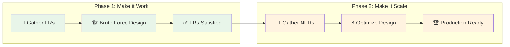
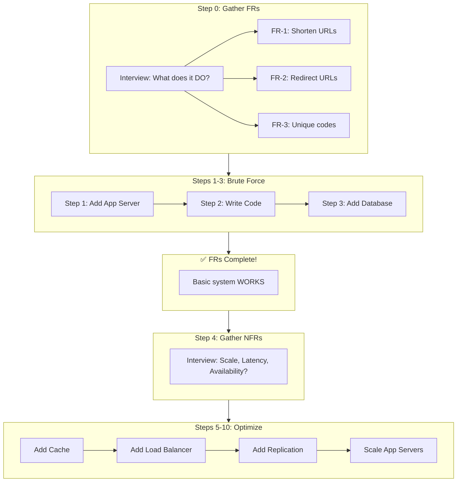

# Requirements Gathering Phase V2 - FR-First Design

## Key Insight: The Brute Force Approach

You're absolutely right. The correct pedagogy mirrors how we teach algorithms:

```
Algorithms:   First O(n²) brute force → Then optimize to O(n log n)
System Design: First make it WORK (FRs) → Then make it SCALE (NFRs)
```

---

## The Corrected Two-Phase Framework



---

## Phase 1: Functional Requirements Only

### Step 0: Gather FRs (The Interview Conversation)

The user should ask the interviewer: **"What does this system need to DO?"**

For TinyURL, the FRs are simple:

| FR# | Functional Requirement |
|-----|----------------------|
| FR-1 | **Shorten**: Given a long URL, return a short URL |
| FR-2 | **Redirect**: Given a short URL, redirect to the original |
| FR-3 | **Unique Codes**: Each short code must be unique |

That's it! No talk of:
- ❌ Traffic volume
- ❌ Latency requirements
- ❌ Availability targets
- ❌ Storage capacity

Those are NFRs - we'll handle them AFTER the basic system works.

### Step 0 UI: Simple FR Gathering

```
┌────────────────────────────────────────────────────────────────────┐
│                         Step 0 of 10                                │
│                                                                     │
│                           🎤                                        │
│                                                                     │
│     INTERVIEWER: "Design a URL shortener like TinyURL"             │
│                                                                     │
│     Before you start drawing, ask: What should this system DO?     │
│                                                                     │
│     ┌──────────────────────────────────────────────────────────┐   │
│     │ 🎯 ASK ABOUT FUNCTIONAL REQUIREMENTS                      │   │
│     │                                                           │   │
│     │ Click to ask the interviewer about core functionality:   │   │
│     │                                                           │   │
│     │ ○ "What are the core operations?"                         │   │
│     │     → Create short URLs + Redirect to originals           │   │
│     │                                                           │   │
│     │ ○ "Do URLs ever get deleted or expire?"                   │   │
│     │     → No, they're permanent                               │   │
│     │                                                           │   │
│     │ ○ "Can users pick custom short codes?"                    │   │
│     │     → Not for MVP, auto-generate them                     │   │
│     │                                                           │   │
│     └──────────────────────────────────────────────────────────┘   │
│                                                                     │
│     ┌──────────────────────────────────────────────────────────┐   │
│     │ ✅ FUNCTIONAL REQUIREMENTS CONFIRMED                      │   │
│     │                                                           │   │
│     │ FR-1: Shorten long URLs to short codes                    │   │
│     │ FR-2: Redirect short codes to original URLs               │   │
│     │ FR-3: Short codes must be unique                          │   │
│     └──────────────────────────────────────────────────────────┘   │
│                                                                     │
│              [ Build the Brute Force Solution → ]                   │
│                                                                     │
│     💡 We're NOT asking about scale or performance yet!            │
│        First, let's just make it WORK.                             │
└────────────────────────────────────────────────────────────────────┘
```

---

### Steps 1-3: Brute Force Solution (FRs Only)

After gathering FRs, the user builds the **simplest possible solution**:

```
Step 1: Add App Server
        → Client can send requests
        → FR-1 partially satisfied (server exists)

Step 2: Write Code  
        → Implement shorten() and expand() in memory
        → FR-1, FR-2, FR-3 all work... but only in RAM!

Step 3: Add Database
        → Data persists across restarts
        → All FRs fully satisfied! 🎉
```

#### The Brute Force Architecture

```
┌─────────────┐         ┌─────────────────┐         ┌─────────────────┐
│   Client    │ ──────▶ │   App Server    │ ──────▶ │    Database     │
│  (Browser)  │ ◀────── │   (1 instance)  │ ◀────── │  (no replicas)  │
└─────────────┘         └─────────────────┘         └─────────────────┘

                    THIS IS ENOUGH FOR FRs!
                    
✅ Can shorten URLs
✅ Can redirect
✅ Codes are unique
✅ Data persists

❌ Slow (no cache)         ← We'll fix in Phase 2
❌ Single point of failure ← We'll fix in Phase 2  
❌ Can't scale             ← We'll fix in Phase 2
```

### Celebration After FR Completion

```
┌────────────────────────────────────────────────────────────────────┐
│                           🎉                                        │
│                                                                     │
│     MILESTONE: Functional Requirements Complete!                    │
│                                                                     │
│     Your brute force solution WORKS:                               │
│     ✅ Users can create short URLs                                 │
│     ✅ Short URLs redirect to originals                            │
│     ✅ Each code is unique                                         │
│     ✅ Data survives restarts                                      │
│                                                                     │
│     ┌──────────────────────────────────────────────────────────┐   │
│     │ BUT WAIT...                                               │   │
│     │                                                           │   │
│     │ The interviewer says: "What if you get 1000 requests     │   │
│     │ per second? What if the database crashes?"                │   │
│     │                                                           │   │
│     │ Now it's time to discuss NON-FUNCTIONAL requirements!     │   │
│     └──────────────────────────────────────────────────────────┘   │
│                                                                     │
│              [ Continue to Phase 2: NFRs → ]                        │
│                                                                     │
└────────────────────────────────────────────────────────────────────┘
```

---

## Phase 2: Non-Functional Requirements (Later Steps)

Only AFTER FRs are satisfied do we ask about NFRs:

### Step 4: Gather NFRs (New Interview Conversation)

```
┌────────────────────────────────────────────────────────────────────┐
│                         Step 4 of 10                                │
│                                                                     │
│     INTERVIEWER: "Your basic system works. Now let's talk scale." │
│                                                                     │
│     ┌──────────────────────────────────────────────────────────┐   │
│     │ ⚡ ASK ABOUT NON-FUNCTIONAL REQUIREMENTS                  │   │
│     │                                                           │   │
│     │ ○ "How much traffic do we expect?"                        │   │
│     │     → 400 reads/sec, 40 writes/sec                        │   │
│     │                                                           │   │
│     │ ○ "What latency is acceptable for redirects?"             │   │
│     │     → Under 100ms (p99)                                   │   │
│     │                                                           │   │
│     │ ○ "What availability do we need?"                         │   │
│     │     → 99.9% uptime                                        │   │
│     │                                                           │   │
│     │ ○ "Is there a budget constraint?"                         │   │
│     │     → Under $500/month                                    │   │
│     └──────────────────────────────────────────────────────────┘   │
│                                                                     │
│     Now we know WHAT to optimize for!                              │
│                                                                     │
└────────────────────────────────────────────────────────────────────┘
```

### Steps 5-10: Optimize for NFRs

| Step | What We Add | NFR Addressed |
|------|------------|---------------|
| 5 | Add Cache (Redis) | Low latency (<100ms) |
| 6 | Add Load Balancer | Handle 400 RPS |
| 7 | Database Replication | High availability (99.9%) |
| 8 | Multiple App Servers | Eliminate SPOF |
| 9 | Cache Strategy Config | Consistency |
| 10 | Cost Optimization | Budget ($500/mo) |

---

## Revised Tutorial Flow



---

## Why This Approach is Better

### 1. Matches Algorithm Interview Thinking
- Algorithm: "First O(n²), then optimize"
- System Design: "First 1 server, then scale"

### 2. Shows Problem-Solving Process
- Interviewers want to see HOW you think
- Starting with brute force shows you can break down problems

### 3. Prevents Over-Engineering
- Common mistake: Jump to distributed systems for simple problems
- This approach: Start simple, add complexity only when needed

### 4. Clear Milestones
- After Step 3: "Does it work?" → Yes!
- After Step 10: "Does it scale?" → Yes!

### 5. Teaches Real Engineering
- Production systems start simple
- Complexity is added incrementally based on needs

---

## Updated Step 0 Content (FR-Focused Only)

```typescript
const step0RequirementsFR: RequirementsGatheringPhase = {
  problemStatement: "Design a URL shortener like bit.ly",
  
  // ONLY functional questions
  questions: [
    {
      id: 'core-operations',
      category: 'functional',
      question: "What are the core operations this system needs to support?",
      answer: "Two main operations:\n1. Shorten: Given a long URL, create and return a short URL\n2. Redirect: Given a short URL, redirect to the original long URL",
      importance: 'critical',
    },
    {
      id: 'url-lifecycle',
      category: 'functional',
      question: "Do URLs ever expire or get deleted?",
      answer: "No, once created, URLs should work forever. They're permanent.",
      importance: 'critical',
    },
    {
      id: 'custom-codes',
      category: 'functional',
      question: "Can users specify their own custom short codes?",
      answer: "Not for the MVP. We'll auto-generate unique codes. Custom codes could be a v2 feature.",
      importance: 'nice-to-have',
    },
    {
      id: 'uniqueness',
      category: 'functional',
      question: "Do short codes need to be unique?",
      answer: "Yes, absolutely. Each short code must map to exactly one URL.",
      importance: 'critical',
    },
  ],
  
  minimumQuestionsRequired: 2, // Just need to understand core FRs
  criticalQuestionIds: ['core-operations', 'uniqueness'],
  
  // NO calculations yet - that's for NFRs!
  calculations: [],
  
  derivedRequirements: {
    functional: [
      "FR-1: Shorten long URLs to unique short codes",
      "FR-2: Redirect short codes to original URLs",
      "FR-3: Ensure short code uniqueness",
    ],
    nonFunctional: [], // Empty for now!
    outOfScope: [
      "Custom short codes (v2)",
      "Analytics/click tracking",
      "URL expiration",
    ],
    keyInsight: "Just make it WORK first. We'll worry about scale later.",
  },
};
```

---

## Summary: The FR-First Pedagogy

1. **Step 0**: Ask "What does it DO?" → Get FRs only
2. **Steps 1-3**: Build brute force solution
3. **Milestone**: "It works!" (FRs satisfied)
4. **Step 4**: Ask "How well does it need to perform?" → Get NFRs
5. **Steps 5-10**: Optimize based on NFRs

This teaches the **correct interview approach**:
- Don't ask about scale until you have a working solution
- Don't add caching until you know the latency requirement
- Don't add replicas until you know the availability target

**First make it work. Then make it fast.**