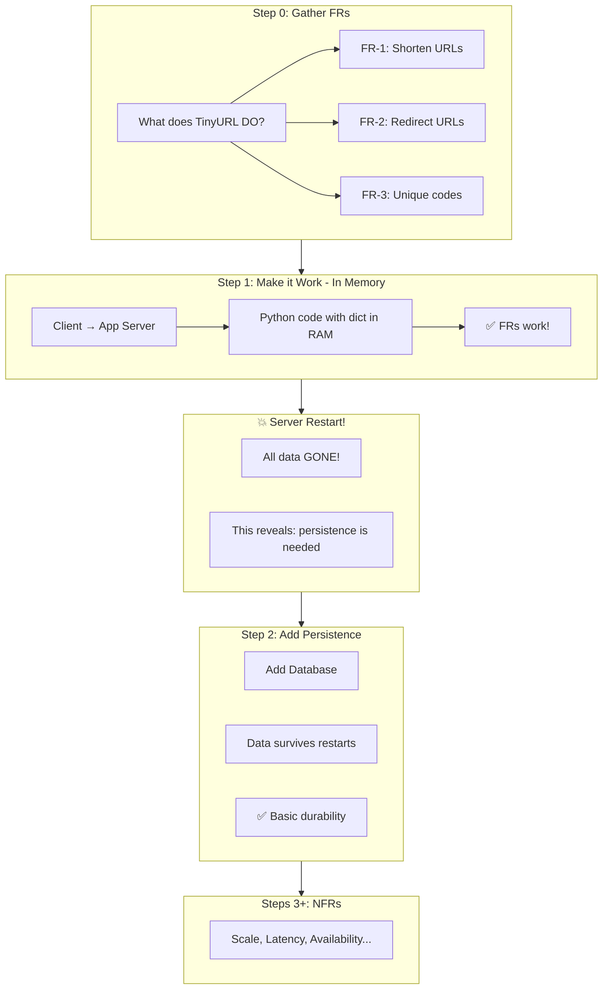

# Requirements Gathering Phase V3 - Ultra-Incremental Design

## The Even More Incremental Approach

You're right! We can make the brute force even simpler:

```
Step 0: Gather FRs
Step 1: Client → App Server (in-memory) → FRs WORK! ✅
Step 2: "What if server restarts?" → Add DB (persistence)
Step 3+: NOW NFRs kick in
```

This teaches:
1. **Functionality first** - Can it shorten and redirect? (Yes, even with just RAM!)
2. **Persistence is a separate concern** - Data loss is the first "NFR" to address
3. **Scale comes last** - Only after basic durability

---

## The Ultra-Incremental Flow



---

## Detailed Step Breakdown

### Step 0: Gather Functional Requirements

**The Interview:**
```
Interviewer: "Design a URL shortener like TinyURL"

Candidate: "Before I start, let me understand what this system needs to DO.
            What are the core operations?"

Interviewer: "Users need to:
             1. Submit a long URL, get back a short URL
             2. Use the short URL to get redirected to the original"

Candidate: "Do URLs need to be unique?"

Interviewer: "Yes, each short code maps to exactly one URL."

Candidate: "Great, I have enough to start. Let me build the simplest
            solution that satisfies these requirements."
```

**FRs Confirmed:**
| FR# | Requirement | Details |
|-----|-------------|---------|
| FR-1 | Shorten | `POST /shorten` → returns short code |
| FR-2 | Redirect | `GET /:code` → 302 redirect |
| FR-3 | Unique | Each code → exactly one URL |

**NOT discussed yet:**
- ❌ Traffic volume
- ❌ Latency requirements
- ❌ Data persistence (!)
- ❌ Availability

---

### Step 1: The Simplest Working Solution (In-Memory)

**Architecture:**
```
┌─────────────┐         ┌─────────────────┐
│   Client    │ ──────▶ │   App Server    │
│  (Browser)  │ ◀────── │   (dict = {})   │
└─────────────┘         └─────────────────┘

                    NO DATABASE!
```

**Python Code:**
```python
# In-memory storage - simplest possible solution
url_map = {}

def shorten(url: str, context: dict) -> str:
    code = hashlib.md5(url.encode()).hexdigest()[:6]
    url_map[code] = url
    return code

def expand(code: str, context: dict) -> str:
    return url_map.get(code)
```

**What works:**
- ✅ Can shorten URLs
- ✅ Can redirect
- ✅ Codes are unique (deterministic hashing)
- ✅ **All FRs satisfied!**

**The celebration screen:**
```
┌────────────────────────────────────────────────────────────────────┐
│                           🎉                                        │
│                                                                     │
│     Your TinyURL WORKS!                                            │
│                                                                     │
│     ✅ Shorten: POST /api/v1/urls → returns short code             │
│     ✅ Redirect: GET /abc123 → redirects to original               │
│     ✅ Unique codes for each URL                                   │
│                                                                     │
│     All Functional Requirements are satisfied!                     │
│                                                                     │
│              [ Continue → ]                                         │
│                                                                     │
└────────────────────────────────────────────────────────────────────┘
```

---

### Step 2: The Crash Story - Introducing Persistence

**The Story Panel:**
```
┌────────────────────────────────────────────────────────────────────┐
│                         Step 2 of 10                                │
│                                                                     │
│                           💥                                        │
│                                                                     │
│     It's 3 AM. Your server crashed and restarted.                  │
│                                                                     │
│     When it came back up... ALL your shortened URLs were GONE!     │
│     Users are furious. Their links don't work anymore.             │
│                                                                     │
│     ┌──────────────────────────────────────────────────────────┐   │
│     │ THE PROBLEM                                               │   │
│     │                                                           │   │
│     │ Data was stored in memory (RAM).                         │   │
│     │ RAM is volatile - it disappears when power is lost.      │   │
│     │                                                           │   │
│     │ We need PERSISTENT storage.                               │   │
│     └──────────────────────────────────────────────────────────┘   │
│                                                                     │
│              [ Add a Database → ]                                   │
│                                                                     │
└────────────────────────────────────────────────────────────────────┘
```

**Updated Architecture:**
```
┌─────────────┐         ┌─────────────────┐         ┌─────────────┐
│   Client    │ ──────▶ │   App Server    │ ──────▶ │  Database   │
│  (Browser)  │ ◀────── │                 │ ◀────── │ (1 machine) │
└─────────────┘         └─────────────────┘         └─────────────┘

                    Single database, no replicas
                    Just persistent storage
```

**What we gain:**
- ✅ Data survives restarts
- ✅ Data survives crashes
- ✅ All FRs still work
- ✅ **Basic durability achieved**

**What we DON'T have yet:**
- ❌ Fast reads (no cache)
- ❌ High availability (single DB)
- ❌ Scalability (one server)

---

### Step 3+: NOW NFRs Begin

**The Transition:**
```
┌────────────────────────────────────────────────────────────────────┐
│                         Step 3 of 10                                │
│                                                                     │
│     INTERVIEWER: "Your basic system works. Now let's discuss       │
│                   how well it needs to perform."                   │
│                                                                     │
│     This is where we gather Non-Functional Requirements:           │
│                                                                     │
│     ┌──────────────────────────────────────────────────────────┐   │
│     │ ⚡ NFR QUESTIONS                                          │   │
│     │                                                           │   │
│     │ ○ "How much traffic should we handle?"                    │   │
│     │ ○ "What latency is acceptable for redirects?"             │   │
│     │ ○ "What availability do we need?"                         │   │
│     │ ○ "Is there a budget constraint?"                         │   │
│     └──────────────────────────────────────────────────────────┘   │
│                                                                     │
└────────────────────────────────────────────────────────────────────┘
```

---

## Complete Tutorial Progression

| Step | Focus | What's Added | Concern |
|------|-------|--------------|---------|
| 0 | FRs | Gather requirements | "What does it DO?" |
| 1 | FRs | Client → App (in-memory) | Functionality |
| 2 | Durability | Add Database | Persistence |
| 3 | NFRs | Gather NFR requirements | "How well?" |
| 4 | Latency | Add Cache | Speed |
| 5 | Scale | Add Load Balancer | Throughput |
| 6 | Availability | Database Replication | Uptime |
| 7 | Scale | Multiple App Servers | Capacity |
| 8 | Consistency | Cache Strategy | Correctness |
| 9 | Capacity | Proper Sizing | Right-sizing |
| 10 | Cost | Optimization | Budget |

---

## Why This Progression is Better

### 1. Teaches Incremental Design
- Start with the absolute minimum
- Add complexity only when a problem reveals itself
- Each step has a clear motivation

### 2. Persistence as First "NFR-Adjacent" Concern
- Technically, persistence could be considered a core requirement
- But it's revealed through the "crash story" - making it memorable
- This is the baseline for any real system

### 3. Clear Separation of Concerns
```
Phase 1: Does it work? (FRs)
Phase 2: Does it persist? (Durability)
Phase 3: Does it scale? (NFRs)
```

### 4. Matches Real Interview Thinking
- Interviewer: "Design TinyURL"
- Candidate: "Let me start with the simplest solution..."
- *builds in-memory*
- Interviewer: "What if the server restarts?"
- Candidate: "Good point, I'll add persistent storage..."
- *adds database*
- Interviewer: "What about 1000 requests per second?"
- Candidate: "Now let's talk about scaling..."

---

## Summary

```
Step 0: "What does it DO?"    → FRs only
Step 1: Client → App Server   → In-memory, FRs work!
Step 2: Add Database          → Persistence (crash story)
Step 3: "How well?"           → NFRs begin
Step 4+: Optimize             → Cache, LB, Replicas, etc.
```

**The key insight:** Even without a database, the basic FRs can be satisfied with just Client → App Server. The database is added to solve the persistence problem, not as a core FR requirement.

**First make it work. Then make it survive. Then make it scale.**